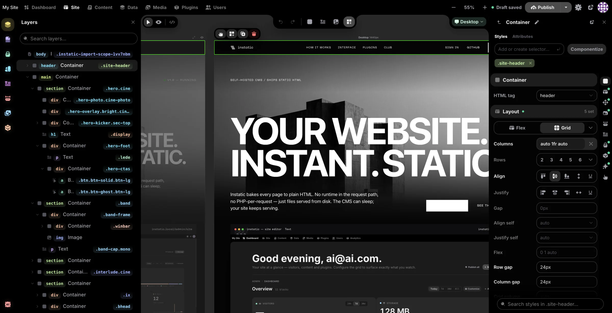
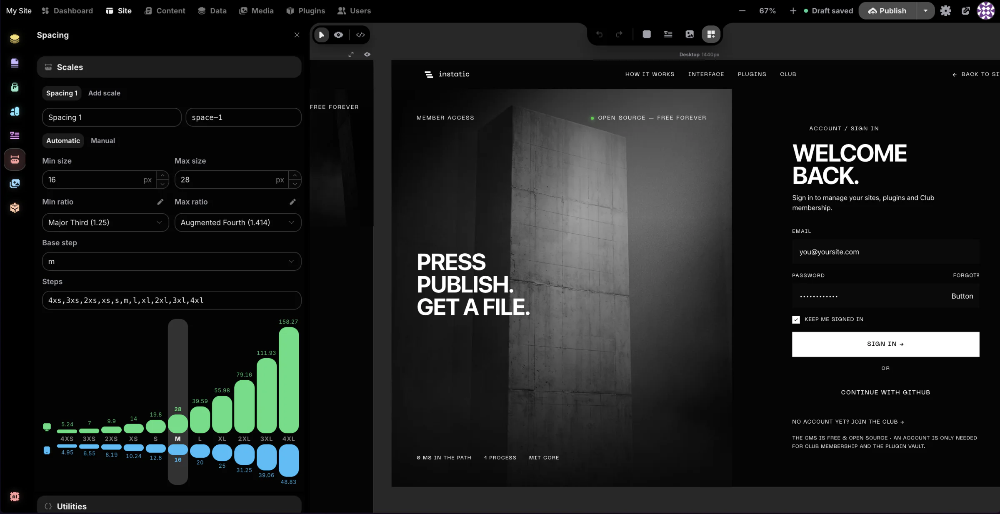
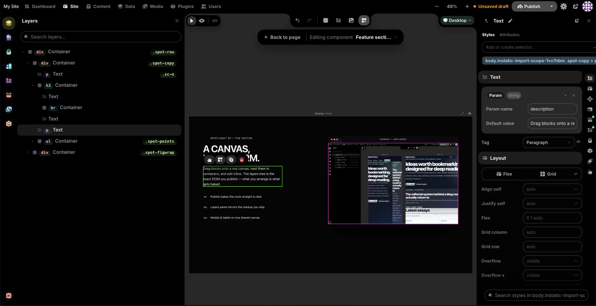
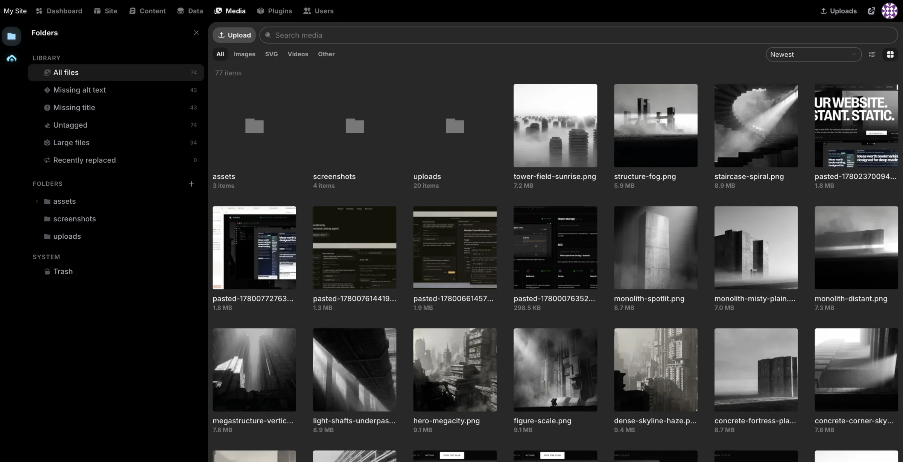
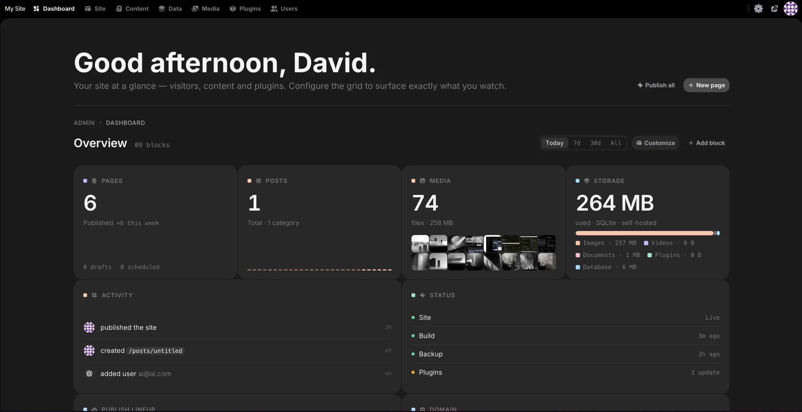

<div align="center">

# Instatic

**Own your site. Love building it.**

The self-hosted visual CMS with a canvas editor that feels like a design tool,
a real content engine underneath, and published pages so clean you'll want to view source.

[](https://github.com/corebunch/instatic/releases)
[](LICENSE)
[](https://bun.sh)
[](https://www.typescriptlang.org/)

[One-Click Deploy](#deploy-in-one-click) · [Quick Start](#quick-start) · [Docs](docs/README.md) · [Plugins](docs/features/plugin-system.md) · [Roadmap](#this-is-the-inception)

<br>



</div>

<br>

> WordPress gives you ownership wrapped in 2003.
> Webflow and Framer give you 2026 — as long as you keep paying rent.
>
> **Instatic is what happens when you refuse to choose.**

For twenty years the deal has been the same. Want to own your site? Enjoy plugin roulette, theme archaeology, and page builders that publish markup soup. Want a modern visual editor? Hand your site to someone else's cloud, behind someone else's subscription, exporting someone else's idea of your content — forever.

We think that deal is expired.

Instatic is a canvas editor that feels like Figma, a content engine that works like a real CMS, and a publisher that ships plain, semantic HTML with hand-clean CSS — the kind of output a senior developer would write by hand. No framework runtime injected into your pages. No builder watermark in your markup. All of it on one Bun server, on hardware you choose, under a license that never asks for your credit card.

**MIT licensed. Self-hosted. Yours.**

<br>

## Deploy in one click

The fastest way to a running Instatic is Railway. One click, ~2 minutes, no terminal — secret keys generated, volumes attached, health checks configured. Truly one click, not "one click and then forty minutes of environment variables."

<div align="center">


*One minute to live. Unedited.*

<br><br>

[](https://railway.com/deploy/instatic-cms-sqlite?referralCode=Zm9bVJ&utm_medium=integration&utm_source=template&utm_campaign=generic)

**SQLite** — one service, one volume. The right default for a single site, a blog, a portfolio, a small business.

[](https://railway.com/deploy/instatic-cms-postgres?referralCode=Zm9bVJ&utm_medium=integration&utm_source=template&utm_campaign=generic)

**Postgres** — for multi-author editorial teams, managed database backups, and room to scale out.

</div>

Prefer your own metal? Instatic ships as a single Docker image:

```sh
INSTATIC_IMAGE=ghcr.io/corebunch/instatic:latest docker compose -f compose.prod.yml -f compose.sqlite.yml up -d
```

Full guides — VPS, Postgres, HTTPS via Caddy, Render, backups: [docs/deployment](docs/deployment/README.md).

<br>

## One tool, the whole cycle

Most tools pick one verb and outsource the rest. Instatic was built to carry a website through its entire life — **design it, build it, manage it, understand it, extend it** — without ever leaving the tool or losing ownership.

### 🎨 Design



The editor is a real canvas, not a form pretending to be a website builder. Multiple breakpoint frames sit side by side — edit the desktop, watch the mobile react. Or flip to live mode and edit a single real-size page in place.

And here's the part the incumbents can't copy: **[Core Framework](https://coreframework.com) is built in natively.** The design-token engine trusted by thousands of WordPress professionals lives inside Instatic — not as a plugin, as a core system:

- **Color tokens with generated shades** — define a brand color, get a full tuned shade scale.
- **Typography scales** — fluid, mathematical type ramps instead of forty hand-picked font sizes.
- **Spacing scales** — consistent rhythm across every page, every breakpoint.
- **Utility class generators** — locked, generated classes emitted into one compact `framework.css`.

Your design system is data, not vibes.

### 🧱 Build



- **Modules** — containers, text, images, buttons, video, lists, and more, composed by drag and drop.
- **Visual Components** — reusable components with **typed parameters and slots**. Change the definition, every instance updates.
- **Templates and loops** — shared headers and footers, post-type layouts, loops bound to content entries, media, or plugin data sources.
- **CMS-native forms** — build forms visually from semantic primitives, submissions land in your own data tables. No third-party form SaaS.
- **An AI agent in the editor** — describe what you want, it builds it on the canvas as real, editable nodes. Bring your own model: Claude, OpenAI, OpenRouter, or local Ollama.
- **Imports that actually work** — paste raw HTML and get editable nodes. Drop an entire static site (HTML, CSS, images, fonts) and Super Import converts it into pages, style rules, and media — conflicts reviewed before commit.

### 🗂 Manage



- **Content workspace** — a focused writing surface for posts and collections, plus live mode so authors edit inside the real design of the site.
- **Data workspace** — pages, posts, components, custom collections, and arbitrary structured tables all share **one universal content model**. Schemas, raw rows, imports, exports, form submissions.
- **Media workspace** — an OS-style file manager: folders, smart folders, bulk operations, usage tracking, replacement workflows, pluggable storage adapters.
- **Real access control** — roles, capabilities, sessions, TOTP MFA with encrypted secrets.
- **⌘K everything** — Spotlight, a fuzzy command palette over the entire admin.
- **Drafts stay drafts** — unpublished edits never leak to visitors.

### 📊 Analyze



A customizable dashboard with a widget registry, a full **audit log** of every meaningful admin action, and form submissions stored in your own tables — queryable, exportable, yours. This is the youngest pillar of the cycle and the one we're most actively growing — see the [roadmap](#this-is-the-inception).

### 🔌 Extend

<!-- TODO shot — extend-plugins.webp: Plugins page showing a plugin's permission prompts.

-->

Every CMS says it has plugins. Ours come with a containment policy.

Instatic plugins ship as zip packages with a manifest and run inside a **QuickJS-WASM sandbox** — no file system, no environment variables, no network unless the site owner explicitly grants it, host by host. **Plugins are guests, not roommates.** The twenty years of "a plugin took down my site and emailed my database to a stranger" stops here.

Inside that sandbox, the SDK is genuinely powerful: routes, storage, lifecycle hooks, loop data sources, scheduled jobs, canvas modules, admin pages, media storage adapters, frontend assets.

Start with the [plugin system docs](docs/features/plugin-system.md) and the [template plugin](examples/plugins/template/README.md).

<br>

## View source. That's the pitch.

<!-- TODO shot — clean-output.webp: devtools view-source of a published page next to the rendered page.

-->

Open any page published by a typical page builder and look at the source. We'll wait.

Instatic publishes **semantic HTML and compact CSS** — no React in your public pages, no editor runtime, no div-soup wrappers, no `data-builder-id` confetti. The admin app and everything that built the page stay out of the page.

Under the hood it's a three-layer pipeline:

- **Static pages are baked to disk at publish time** and swapped atomically — visitors are served files, not renders.
- **Dynamic routes** hit an in-memory render cache that's invalidated wholesale on every publish.
- **Request-dependent fragments** are auto-detected and lazy-loaded by a runtime that weighs **~0.7 kB** — smaller than this paragraph's HTML.

The result: websites that load like static files, because mostly they are — and never feel trapped inside the tool that made them. Full design: [the publisher](docs/features/publisher.md).

<br>

## Quick start

You need [Bun](https://bun.sh). That's it — the default dev setup is SQLite, zero external services.

```sh
git clone https://github.com/corebunch/instatic.git
cd instatic
bun install
bun run dev
```

Open `http://localhost:5173` — the first visit creates your site and owner account.

To run production mode locally (built admin served by the Bun server): `bun run start`, then `http://localhost:3001/admin`.

> **Backups, in one sentence:** back up the database (Postgres dump or the SQLite file) *and* the uploads volume — [details](docs/deployment/backup-restore.md).

<br>

## From the team behind Motion.page & Core Framework

Instatic isn't our first rodeo. We're the team behind **[Motion.page](https://motion.page)** and **[Core Framework](https://coreframework.com)** — tools used by thousands of professionals who build websites for a living, mostly inside the WordPress ecosystem.

We spent years making other platforms more bearable. Eventually the question became unavoidable: *what if the platform itself was just… right?* No legacy to route around, no markup we're not allowed to clean, no business model that requires holding your site hostage.

So we built it. And we brought Core Framework with us — natively integrated, so the color shades, typography scales, spacing systems, and utility generators our users love are a core part of Instatic, not an add-on you install and pray over.

<br>

## This is the inception

Here's the uncomfortable fact for everyone else: **this is version 0.0.x.**

The visual canvas, the Core Framework integration, the universal content model, the sandboxed plugin runtime, the AI agent, forms, loops, templates, media management, MFA, audit logging, one-click deploys, the clean-output publisher — all of that is the *starting point*. Where we're heading:

- **Deeper analytics** — first-party, privacy-respecting insight into your site, completing the analyze pillar.
- **A growing module and plugin ecosystem** — more first-party blocks, more SDK surface, more examples.
- **A more capable AI agent** — broader tools, deeper site awareness.
- **Sharper everything** — we're pre-1.0 on purpose: young enough to keep the architecture clean, remove bad ideas, and build the CMS we actually want to use.

APIs and workflows may still change before a stable 1.0. If you're allergic to motion, wait for 1.0. If you want to shape what the next twenty years of website ownership looks like — you're early, and early is the best seat.

<br>

## For developers

One Bun server. A Vite-built React admin. A publisher that emits pages you'd be proud to write by hand.

| | |
|---|---|
| **Runtime** | Bun — server and tooling |
| **Language** | TypeScript everywhere |
| **Admin app** | React 19 (React Compiler enabled), Vite, Zustand + Mutative, CodeMirror, dnd-kit |
| **Server** | `Bun.serve` with a hand-written router |
| **Database** | SQLite or Postgres — one `DbClient` interface, selected by `DATABASE_URL` |
| **Validation** | TypeBox at every untyped boundary — schemas are the source of truth |
| **Plugins** | QuickJS-WASM sandbox, owner-granted permissions |
| **AI** | Provider-agnostic drivers over raw HTTP/SSE — no provider SDKs |
| **Output** | Semantic HTML, compact CSS, static artefacts + auto-detected dynamic holes |

The codebase is opinionated and the opinions are enforced — architectural rules live in `src/__tests__/architecture/` as tests, so the clean structure stays clean.

```sh
bun run build   # tsc -b && vite build
bun test
bun run lint
```

Dive in: [docs index](docs/README.md) · [architecture](docs/architecture.md) · [editor](docs/editor.md) · [server](docs/server.md) · [publisher](docs/features/publisher.md) · [plugin system](docs/features/plugin-system.md)

<br>

## Thanks

Instatic's interface uses [Pixelarticons](https://pixelarticons.com/) by Gerrit Halfmann. A special thanks to Gerrit for making such a distinctive icon set and for kindly allowing its use in this open-source project.

## License

MIT. See [LICENSE](LICENSE). No tiers, no "open core", no asterisks.
